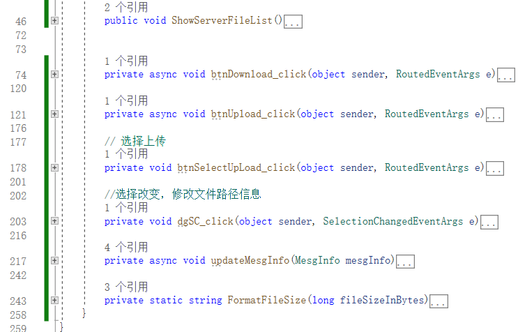
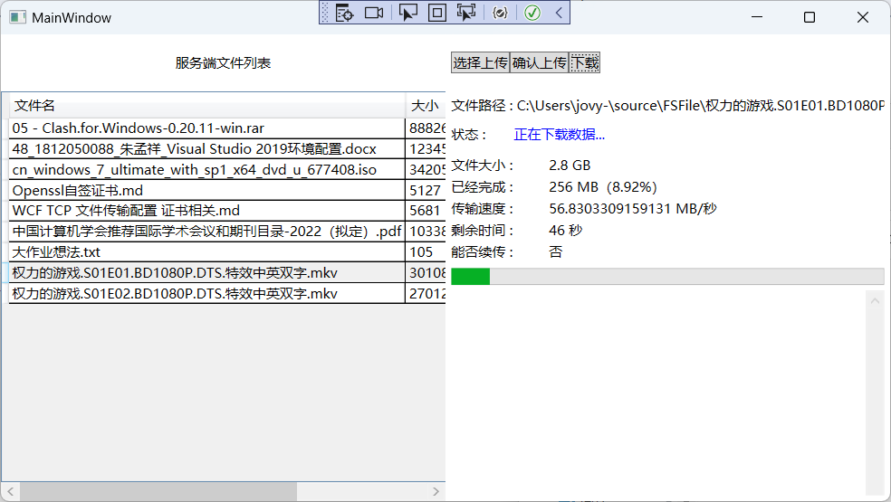

# 一、实验要求

**要求实现一种简单但安全的文件传输协议**

- 能多用户并发访问，文件可完整地传输
- 通信全过程可抵御中间人、DDoS、SQL注入等常见攻击

# 二、环境配置

## 1. 电脑配置

```
操作系统：win11
虚拟机：VM kali-2022
编译器：Visual Studio 2022
编程语言：C#
编程框架：WPF、WCF
编程模式：C/S
```

## 2. GitHub链接

https://github.com/jovy-rtt/AzFileTransfer

## 3. 特殊配置

```
需要使用MMC在windows上添加证书。
使用Openssl 生成自签名根证书和CS证书
```

# 三、实验步骤

## 1. 生成CA根证书和CA证书

```
按照以下步骤使用OpenSSL来创建一个带有自定义主题名称的自签名证书：

1. 下载并安装OpenSSL工具，它是一个免费的开放源代码安全套接字层（SSL）和传输层安全（TLS）协议的实现。

2. 打开命令提示符或终端窗口。

3. 输入以下命令以生成一个私钥：

   openssl genpkey -algorithm RSA -out private.key

   这会生成一个2048位的RSA密钥对，并将私钥保存到名为"private.key"的文件中。

4. 输入以下命令以生成一个证书签名请求（CSR）：

   openssl req -new -key private.key -out cert.csr

   在这个命令中，您需要回答一些关于您的组织和证书的问题。当您被要求输入"Common Name"时，您可以输入您想要用作主题名称的名称。例如，如果您要将证书用于服务器，则可以输入服务器的完全限定域名（FQDN）作为主题名称。

5. 生成自签名证书，可以使用以下命令：

   openssl x509 -req -in cert.csr -signkey private.key -out cert.crt

简要操作：


openssl req -newkey rsa:2048 -nodes -keyout ca.key -x509 -days 365 -out ca.crt
openssl req -newkey rsa:2048 -nodes -keyout client.key -out client.csr
openssl req -newkey rsa:2048 -nodes -keyout server.key -out server.csr

注意！！！ 需要在生成证书请求文件时，对CN进行更改，我使用的是Az-org（CN即是导入后，你证书的名称！！）

6. 生成证书启用扩展 EKU OID 并设置为客户端服务端双向认证，由于WCF在最新的.NET版本中更新了证书链验证方式，所以需要增加性密钥扩展
openssl x509 -req -in client.csr -CA ca.crt -CAkey ca.key -CAcreateserial -out client.crt -days 365 -extensions client_cert -extfile <(echo "[client_cert]\nextendedKeyUsage=clientAuth"))
openssl x509 -req -in server.csr -CA ca.crt -CAkey ca.key -CAcreateserial -out server.crt -days 365 -extensions server_cert -extfile <(echo "[server_cert]\nextendedKeyUsage=serverAuth"))

7. 导出
openssl pkcs12 -export -in client.crt -inkey client.key -out client.pfx
openssl pkcs12 -export -in server.crt -inkey server.key -out server.pfx
```

## 2. 安装证书

将 CA 根证书和客户端/服务端证书导入到 Windows 本机中。这可以通过以下步骤完成：

- 将 `ca.crt`、`client.crt` 和 `client.key` 复制到 Windows 本机上的某个目录中（例如 `C:\certs`）。
- 右键单击 `ca.crt`，选择“安装证书”，然后按照向导完成导入过程。将证书导入到“受信任的根证书颁发机构”存储区中。
- 右键单击 `client.crt`，选择“安装证书”，然后按照向导完成导入过程。将证书导入到“个人”存储区中。
- 右键单击 `client.pfx`，选择“安装证书”，然后按照向导完成导入过程。将证书导入到“个人”存储区中。

这样，你就可以将客户端证书和私钥导入到 Windows 本机中，并在使用该证书的应用程序中使用它们了，服务端同理。

## 3. 开始编写服务端

1. 新建WCF服务

2. 配置WCF配置文件

   配置文件模板如下：

   ```xml
   <system.serviceModel>
       <behaviors>
           <!-- 定义服务行为 -->
       </behaviors>
       <bindings>
           <!-- 定义服务绑定 -->
       </bindings>
       <services>
           <!-- 定义服务 -->
       </services>
   </system.serviceModel>
   ```

   说明：

   1. <behaviors> 元素：

      ```
      该元素用于定义服务行为，包括安全性、可靠性、实例管理等方面的配置。例如，可以使用 <behaviors> 元素配置服务的身份验证模式、会话超时时间、错误处理策略等。
      ```

   2. <bindings> 元素：

      ```
      该元素用于定义服务绑定，即服务使用的通信协议和消息格式。例如，可以使用 <bindings> 元素配置服务使用的传输协议（如 TCP、HTTP、HTTPS 等）、编码方式（如 XML、JSON、二进制编码等）、消息大小限制等。
      ```

      

   3. <services> 元素：

      ```
      该元素用于定义服务及其行为和绑定。例如，可以使用 <services> 元素配置服务类型、服务地址、行为和绑定等。
      ```

3. 配置文件解读

   在视频讲解中解读。

4. 定义服务协定和消息协定

   服务协定如下：

   ```c#
   [OperationContract]
   List<FileInfo> GetAllFiles();
   
   [OperationContract]
   Stream DownloadStream(FileInfo fileinfo);
   
   [OperationContract]
   void UploadFile(FileUploadMessage fileUploadMessage);
   ```

   消息协定如下：

   ```
   [MessageContract]
   public class FileUploadMessage
   {
       [MessageHeader]
       public string FileName { get; set; }
   
       [MessageHeader]
       public long TotalFileSize { get; set; }
   
       [MessageHeader]
       public long CurrentFileSize { get; set; }
   
       [MessageBodyMember]
       public byte[] FileData { get; set; }
   }
   
   [MessageContract]
   public class FileDownLoadMessage
   {
       [MessageHeader]
       public FileInfo fiFileInfo { get; set; }
       [MessageHeader]
       public long lOffset { get; set; }
       [MessageHeader]
       public long lFileSize { get; set; }
       [MessageBodyMember]
       public byte[] abtFileData { get; set; }
   }
   ```

主要思路是，分块异步下载上传！

## 4. 协议设计

1. FileUploadMessage协议。


2. FileDownLoadMessage协议

   

同理fiFileInfo表示文件下载的信息，lOffset便是当前文件下载的文件流指针（为了支持块传输！），lFileSize表示该块大小。abtFileData主体数据！

## 5. 开始编写客户端

客户端配置与服务端对称，代码如下：

```xml
<?xml version="1.0" encoding="utf-8" ?>
<configuration>
    <startup> 
        <supportedRuntime version="v4.0" sku=".NETFramework,Version=v4.7.2" />
    </startup>
	<!--<appSettings>
		<add key="wcf:useLegacyCertificateUsagePolicy" value="true" />
	</appSettings>-->
    <system.serviceModel>
    
        <bindings>
            <netTcpBinding>
                <binding name="azSecureTcpBinding" transferMode="Streamed" maxReceivedMessageSize="2147483647">
					<readerQuotas maxDepth="32" maxStringContentLength="2147483647" maxArrayLength="2147483647" maxBytesPerRead="4096" maxNameTableCharCount="16384" />
                    <security>
                        <transport clientCredentialType="Certificate" />
                    </security>
                </binding>
            </netTcpBinding>
        </bindings>

		<behaviors>
			<!-- 定义服务行为 -->
			<endpointBehaviors>
				<behavior name="azSecureClientBehavior">
					<clientCredentials>
						<serviceCertificate>
							<authentication certificateValidationMode="None" revocationMode="NoCheck" trustedStoreLocation="LocalMachine" />
							<!--<defaultCertificate findValue="AZS-cert" storeLocation="LocalMachine" storeName="My" x509FindType="FindBySubjectName" />-->
						</serviceCertificate>
						<clientCertificate findValue="AZC-cert" storeLocation="LocalMachine" storeName="My" x509FindType="FindBySubjectName"/>
					</clientCredentials>
				</behavior>
			</endpointBehaviors>
		</behaviors>
		
        <client>
            <endpoint address="net.tcp://localhost:52888/Service1/" binding="netTcpBinding"
                bindingConfiguration="azSecureTcpBinding" contract="ServiceReference1.IService1"
                name="SecureEndpoint" behaviorConfiguration="azSecureClientBehavior">
                <identity>
                    <dns value="AZS-cert" />
                </identity>
            </endpoint>
        </client>

    </system.serviceModel>
</configuration>
```

客户端主要函数如下：



## 6. 运行测试

服务端：


客户端：

开始界面：


下载界面：



上传界面：


# 四、遇到的坑

```
1. 由于WCF只支持Win平台，所以资料不多，而且还牵涉到证书的部署，所以很少！
2. 配置文件中，证书要求无法检验吊销列表，所以需要额外的配置。
在 WCF 配置文件中，<clientCertificate> 元素用于指定客户端证书的配置信息，例如证书存储位置、名称、查找方式等。其中，<authentication> 子元素用于指定客户端证书验证的选项。

在给定的配置中，<authentication> 子元素包含两个属性：

1. certificateValidationMode：用于指定客户端证书验证的模式。在此配置中，将该属性设置为 "PeerTrust"，表示客户端证书将由服务端信任的证书颁发机构 (CA) 进行验证。这意味着客户端证书必须由一个服务端信任的 CA 签发，才能被服务端信任和接受。如果客户端证书由不受信任的 CA 签发，服务端将无法验证该证书的有效性。
2. revocationMode：用于指定证书撤销检查的模式。在此配置中，将该属性设置为 "NoCheck"，表示服务端不会检查客户端证书是否已被撤销。这是一种弱化的验证方式，因为即使证书已被撤销，服务端也仍然会信任该证书。

需要注意的是，<authentication> 子元素的具体配置内容会因实际需求和场景而有所不同。例如，如果您需要使用更严格的证书验证方式，可以将 certificateValidationMode 属性设置为 "ChainTrust"，这将启用整个证书链的验证，并且要求所有证书都必须由信任的 CA 签发。如果您需要在服务端检查证书的撤销状态，可以将 revocationMode 属性设置为 "Online" 或 "Offline"，这将启用在线或离线的撤销检查。

```

# 五、说明

由于使用的WCF框架，使用消息协定进行协议设计，所以交互由IIS接管，密钥协商与加密传输均为其接管，所以流程图无法显示出来。但是难点就在于如何配置，配置证书的验证以及设置花费了两天时间。

其次是使用异步并行编程，支持大文件传输，所以调bug比较多。文件传输打破了数据限制，因为WCF的文件传输最大只能支持2G的文件传输，所以只能采用分块传输的思想！

最后，想实现多线程下载，思路已有，利用计算机的多个线程同时下载同一个文件，在WCF中就是用多任务实现，多线程下载思路：

1. 确定要下载的文件文件和本地保存路径。
2. 使用代理，异步获取要下载的文件的总大小。
3. 根据总大小，将文件分成若干个块，并为每个块分配一个线程。
4. 每个线程根据分配到的块的大小和起始位置，发送代理异步下载请求，下载对应的块。
5. 下载完成后，每个线程将下载的块写入到本地文件对应的位置。
6. 所有线程完成下载后，将所有下载的块合并成一个完整的文件。

由于时间紧急，所以无法实现该功能。

